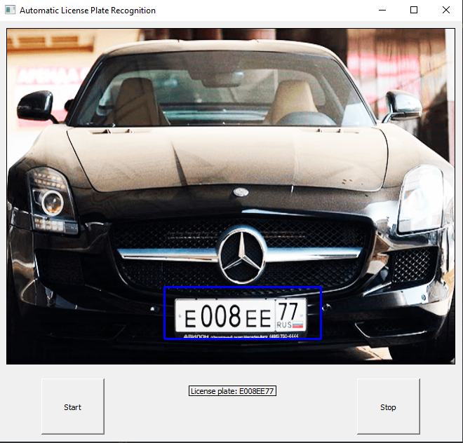
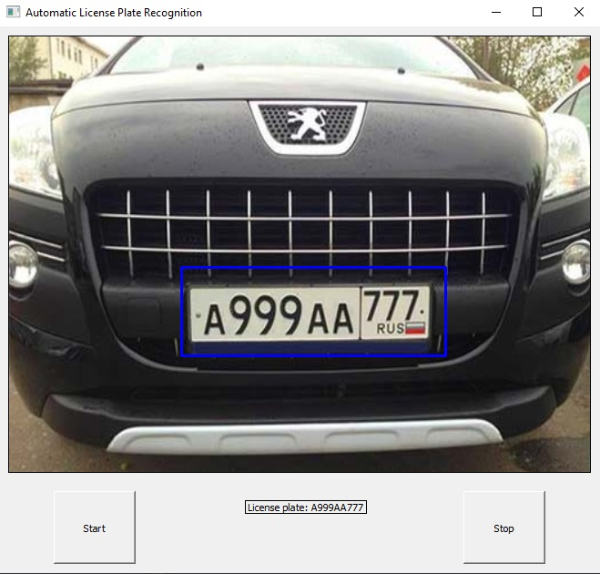
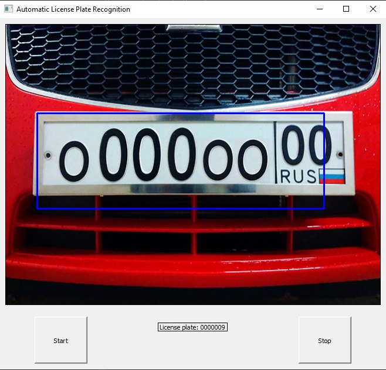
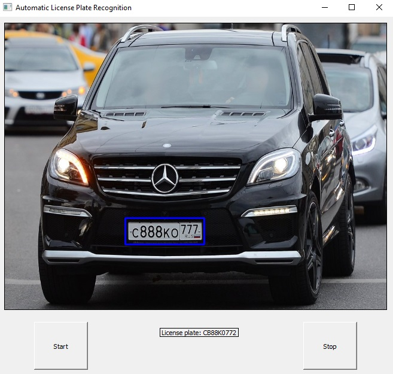

### System-For-Recognizing-Russian-License_Plates
This system based on classic computer vision methods for video frames preprocessing and used Pytesseract for optical character recognition
### Before starting
1) Make sure that you installed Tesseract correctly for your OS;
2) Install all necessary packages from requirements.txt
3) (temporarily) move file 'haarcascade_russian_plate_number.xml' from OpenCV module to current directory;
### Run main.py

### Some incorrect cases:

